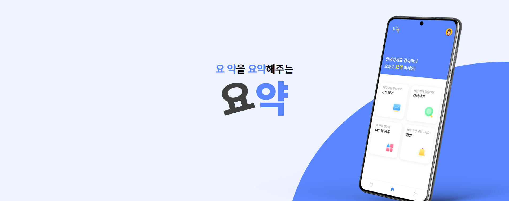
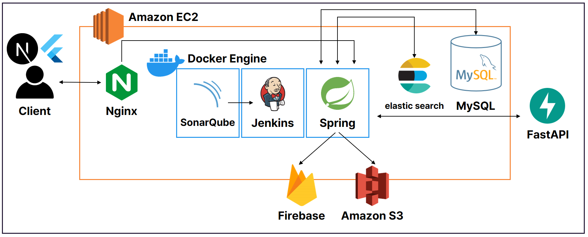

# 💊 요약 - 요 약을 요약해주는 앱



# 🌟 서비스 소개

이 약이 뭐였더라 잊어버린 적 있으신가요?
빽빽한 주의사항 꼼꼼하게 읽고 계신가요?

저희는 약을 이미지로 촬영하여 AI를 통해 어떤 약인지 정보를 알려주고,
약에 대한 정보를 요약해서 알려주고자 시작했습니다.

요약에서 약 정보를 얻어보세요!

<br>

# 💡 주요 기능

### 사진으로 필터로 알약 검색

-   사진을 촬영하거나 이미지를 선택할 수 있어요.
    -   여러 개의 알약을 인식할 수 있어요.
    -   인식한 결과를 통해 알약 상세 보기를 할 수 있어요.
-   알약의 모양, 색, 제형과 같은 특징으로 검색할 수 있어요.
-   알약 전문 검색을 통해 검색할 수 있어요.

### 요약해주는 알약 상세 정보

-   LLM을 통해 요약한 알약 정보를 한 줄로 알려드려요.
-   알약의 효능효과, 사용법, 주의사항을 볼 수 있어요.
-   저장하기를 통해 약 봉투에 저장하고 다시 볼 수 있어요.

### 돌보미를 통한 가족 관리

-   부모님, 자녀, 애완동물 등 돌보미를 추가할 수 있어요.
    -   돌보미의 이름, 나이, 병력 등 정보를 입력할 수 있어요.
-   약 봉투, 알림에서 돌보미 별로 정보를 볼 수 있어요.

### 복용 알림 설정 및 푸시 알림

-   복용 알림을 생성하고 시간에 따라 푸시 알림을 보내드려요.
-   알림에 복용 여부를 기록할 수 있어요.
    -   복용한 경우 복용 시간을 기록할 수 있어요.
    -   복용하지 않은 경우 건너뛰기로 표시할 수 있어요.

### 챌린지를 통해 꾸준히 약 먹기

-   챌린지를 통해 자신이 약 먹기 정보를 진행 바를 통해 확인할 수 있어요.
-   다른 사람의 챌린지를 둘러보고 응원하기를 통해 동기부여를 할 수 있어요.

<br>


# 🛠️ 주요 기술 스택

 **Management Tool**


  
 **BackEnd**


 **FrontEnd**


 **DataBase**


**ETC**


**IDE**


<br><br>

# ⚙ 시스템 아키텍쳐



<br>

# 🗂 프로젝트 파일 구조

### Backend
```
.yoyak
|-- 📂account
|   |-- 📂controller
|   |-- 📂domain
|   |-- 📂dto
|   └-- 📂service
|-- 📂challenge
|-- 📂deviceToken.domain
|-- 📂medicine
|-- 📂medicineDetail
|-- 📂medicineEnvelope
|-- 📂medicineSaved
|-- 📂notification
|-- 📂notificationTime
|-- 📂python.service
|-- 📂recognition
|-- 📂user
└-- 📂util
    |-- 📂aop
    |-- 📂dto
    |-- 📂elasticsearch
    |-- 📂exception
    |-- 📂firebase
    |-- 📂jackson
    |-- 📂jwt
    |-- 📂s3
    |-- 📂security
    |-- 📂server
    └-- 📂user
```
### FrontEnd
```
.yoyak
|-- 📂 android
|-- 📂 assets
|-- 📂 build
|-- 📂 ios
|-- 📂 lib
|   |-- 📂 components
|   |-- 📂 hooks
|   |-- 📂 screen
|   |   |-- 📂 Alarm
|   |   |-- 📂 Challenge
|   |   |-- 📂 Home
|   |   |-- 📂 Login
|   |   |-- 📂 Main
|   |   |-- 📂 Mypage
|   |   |-- 📂 PillBag
|   |   |-- 📂 Search
|   |   └-- 📂 SignUp
|   |-- 📂 security
|   |-- 📂 store
|   └-- 📂 styles
|       └-- 📂 colors
```

<br>

# 📋 프로젝트 산출물

- [요구사항 명세서](https://gpolya.notion.site/1-1f83cfe2412f47c6a44feadcd8310bbd?pvs=4)
- [API 명세서](https://gpolya.notion.site/API-dfbe58a8b1c04e30a118784ea4ac0446?pvs=4)
- [ERD](https://www.erdcloud.com/d/CvgYZsDvxi7Bdfvi8)
- [와이어프레임](https://www.figma.com/file/KdEqQscVLYHN2hXUSfPVEo/%EC%9A%94%EC%95%BD?type=design&node-id=0-1&mode=design&t=UyKlj5WlR9TGr0lG-0)

<br>

# 👩‍💻 팀원 역할 분배

| 김희수            | 신성현   | 이혜진   | 김성현  | 오지훈  | 유지원  |
| ----------------- | -------- | -------- | ------- | ------- | ------- |
|  |  |  |  |    |   |
| Leader & Backend | Backend | Backend | Frontend | Frontend | Frontend |